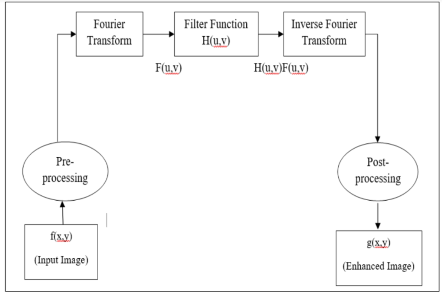
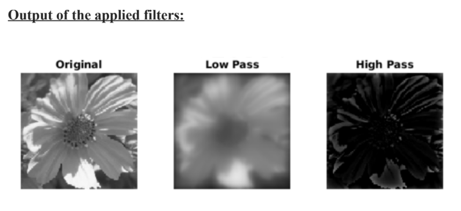

# Image Enhancement Using Frequency Domain Filters🚥

 Frequency Domain Filters are used for smoothing and sharpening of image by removal of high or low frequency components. Sometimes it is possible to remove very high and very low frequencies. Frequency domain filters are different from spatial domain filters as it basically focuses on the frequency of the images. It is basically done for two basic operations i.e., Smoothing and Sharpening

### Our Choice of the Frequency Domain Filter is the Butterworth low and high pass filter!

The repository consists of 5 files
1. bhp.m - High pass filter code
2. blpf.m - Low pass filter code
3. fftrans.m - fourier transform code
4. FreqFilter.m - main file to be run
5. invfft.m - Inverse fourier transform code

